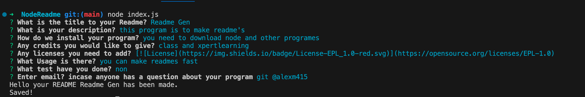

# Readme Gen

## Description

This node program helps you make Readme.Md files

## Table of Contents

[Description](#Description) [Installation](#installation) [Credits](#credits) [License](#license) [Images](#images) [Links](#links) [Questions](#questions)

## Installation

You need to download node and than install inquirer to get user input

## Credits

Class office hours and xpertlearning

## User Experiance

When the user inputs what they want in the readme the program than places that input where it belongs.

## Images

## Links

https://github.com/Alexm415/NodeReadme

https://drive.google.com/file/d/1cjmikbRf1Gn8VsTgRPkg-XkfQNEPpXPl/view?usp=sharing

## Questions

git @alexm415
